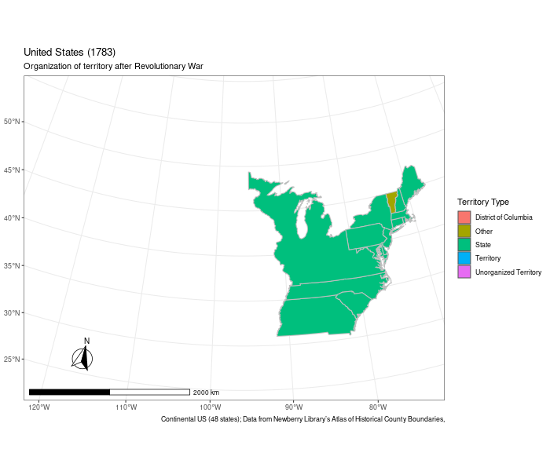

On September 3, 1783, the United States and Great Britain signed the Treaty of Paris. The Treaty ended the American Revolution, with Great Britain recognizing the United States as an independent nation. While the United States has existed for less than 250 years, its political boundaries have increased over 360%. We can use R to animate the growth of US borders over time.

To present the borders of the US over time, we can use shapefiles to store geospatial information that can be plotted and modified. Luckily for us, the Newberry Library stores an atlas of the historical county boundaries of the US. You can either download the files on their website or use their package `USAboundaries` for direct access.

```{r}
install.packages("USAboundaries")
# Or 
# devtools::install_github("ropensci/USAboundaries")
# devtools::install_github("ropensci/USAboundariesData")
```

This post will focus on just the continental US. With a simple `lapply` call (or `map` in other languages), we can download the US' state boundaries for every year in the data set.

```{r, message=FALSE}
library(USAboundaries)
library(dplyr)
library(sf)
continental_us <- state_codes$state_name[-c(2, 12, 52:69)]
dates <- seq(as.Date("1783-09-03"), as.Date("2000-12-31"), by = "years")
maps <- lapply(dates, function(date) {
  map <- us_states(map_date = date, resolution = "high", states = continental_us)
  map$year <- date
  map$states <- TRUE
  map
}) %>%
  bind_rows()
```

The final object, `maps`, is a spatial dataframe allowing for all operations of both dataframes and spatial objects. In our case, each row corresponds to information of a state at some point in time. The geometry column stores the polygon which defines the boundaries.

```{r}
head(maps)
```

Before plotting our maps, there is one last important concept -- projection. A projection is a method of mapping a 3D object (the Earth) onto a 2D sheet (a map). Regardless of the projection used, the image is unfortunately distorted in some manner. Usually, projections trade-off distortions between scale (or size) with shape. Projections may also create uneven distortions where some areas on the map have little distortion while others are heavily distorted. Many American maps use the [Albers projection](https://en.wikipedia.org/wiki/Albers_projection), as the distortions are minimal for the US area.

<figure>
<p align="center">

</p>
<figcaption>
Albers projection. All the circles are identical in 3D space, however, they distort when mapped to 2D space. Note that the circles in North America are minimally distorted.
</figcaption>
</figure>

### Plotting maps with spatial dataframes is easy with ggplot!
With `geom_sf()`, plotting maps in ggplot is identical to using regular ggplot.
```{r}
library(ggplot2)

albers_projection <- paste0(
  "+proj=aea +lat_1=29.5 +lat_2=45.5 +lat_0=37.5 ",
  "+lon_0=-96 +x_0=0 +y_0=0 +ellps=GRS80 ",
  "+datum=NAD83 +units=m +no_defs"
)

filter(maps, year=="1784-09-03") %>%
  ggplot() +
  geom_sf(aes(fill = name)) +
  coord_sf(crs = albers_projection) +
  theme_bw() +
  labs(title = "United States (1784)",
       fill = "States",
       caption = "Thirteen Colonies + Vermont Republic")
```

### Animating the map
Since we stored our data in a geospatial dataframe, we can filter on year to animate the plots. The filtering happens with `transition_manual(year)`, which creates a new frame for the animation for each different year. With `{frame}` you can reference the frame if you want to change text to reflect the year of the map. For example the function, `historical_events(frame)` adds a subtitle with some historical events for that year. `gganimate` lazily builds the animation i.e. does not create the animation until `animated_map` or `animate()` is called. Depending on the complexity of the shapefile and the strength of your computer, generating the animation may take a couple of minutes.

```{r eval=FALSE}
library(gganimate)
library(ggspatial)

historical_events <- function(frame) {
  year <- 1783 + (frame - 1)
  event <- case_when(
    year <= 1803 ~ "Organization of territory after Revolutionary War",
    year <= 1819 ~ "Purchase of Louisiana and Spanish Cession",
    year <= 1845 ~ "Northwest expansion (inc. Trail of Tears)",
    year <= 1861 ~ "Mexican-American War and Southwest expansion",
    year <= 1865 ~ "Civil War",
    year <= 1897 ~ "Reconstruction and western statehood",
    year <= 1945 ~ "Pacific and Caribbean expansion (not included)",
    year <= 2000 ~ "Present day"
  )
  return(event)
}

## Full size US
usa <- filter(maps, year == "2000-9-3")
usa$geometry <- st_union(usa)
usa <- slice(usa, 1)
usa[,-length(colnames(usa))] = NA
usa[nrow(usa)+length(dates)-1,] <- NA
usa$year <- dates
usa$geometry <- usa$geometry[1]
usa$states <- FALSE

maps <- bind_rows(maps, usa) 

animated_map <- ggplot(maps) +
  geom_sf(aes(color = states, fill = terr_type)) +
  coord_sf(crs = albers_projection) +
  theme_bw() +
  transition_manual(year) +
  labs(
    title = "United States ({1783 + (frame - 1)})",
    subtitle = "{historical_events(frame)}",
    caption = paste(
      "Continental US (48 states); Data from",
      "Newberry Library’s Atlas of Historical County Boundaries,"
    )
  ) +
  annotation_north_arrow(
    location = "bl", which_north = "true",
    pad_x = unit(0.75, "in"), pad_y = unit(0.5, "in"),
    style = north_arrow_fancy_orienteering
  ) +
  annotation_scale(location = "bl", width_hint = 0.5) +
  scale_color_manual(values = c("grey", "black")) +
  guides(fill = guide_legend(title = "Territory Type"),
         color = FALSE)

gif <- animate(animated_map, renderer = gifski_renderer(),
               nframes = length(dates), duration = 75) 
anim_save("us_expansion.gif", gif)
```

<figure>
<p align="center">

</p>
<figcaption>
</figcaption>
</figure>

[You can see the full script on my github here](https://github.com/badbayesian/personal_website/blob/master/content/post/2020-08-10-us-expansion/us_expansion.R).

